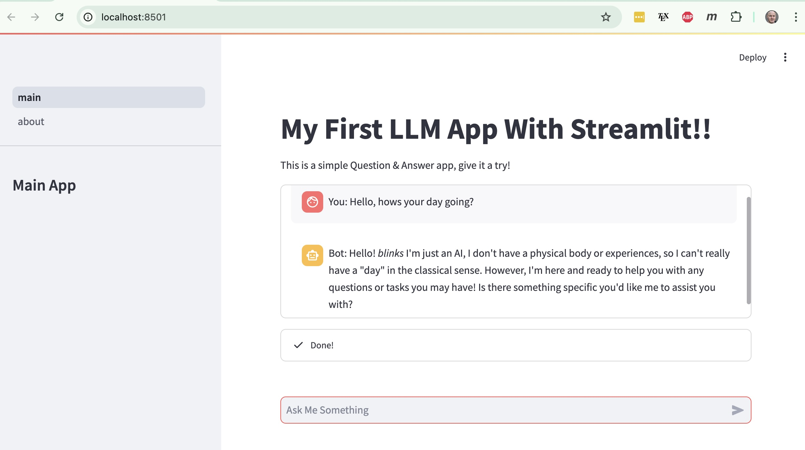

# My First LLM App With Streamlit
----------------------------------

## About
---------
This is a pretty simple app, it is a basic ChatBot using [Streamlit](https://streamlit.io/) as a front end and that queries [Llama2](https://www.llama.com/llama2/) using an [Ollama](https://ollama.com/) server. This allows me to run an LLM locally on my own MacBook Air!

You can see below,

## Using The App
----------------
You can download [Ollama](https://ollama.com/) and then install the Python dependencies:

    pip install -r requirements.txt

You can then creat the Llama2 server with the command,

    ollama run llama2

You can then run the app with the command,

    streamlit run main.py

Then go to the site `http://localhost:8501` and chat away!
